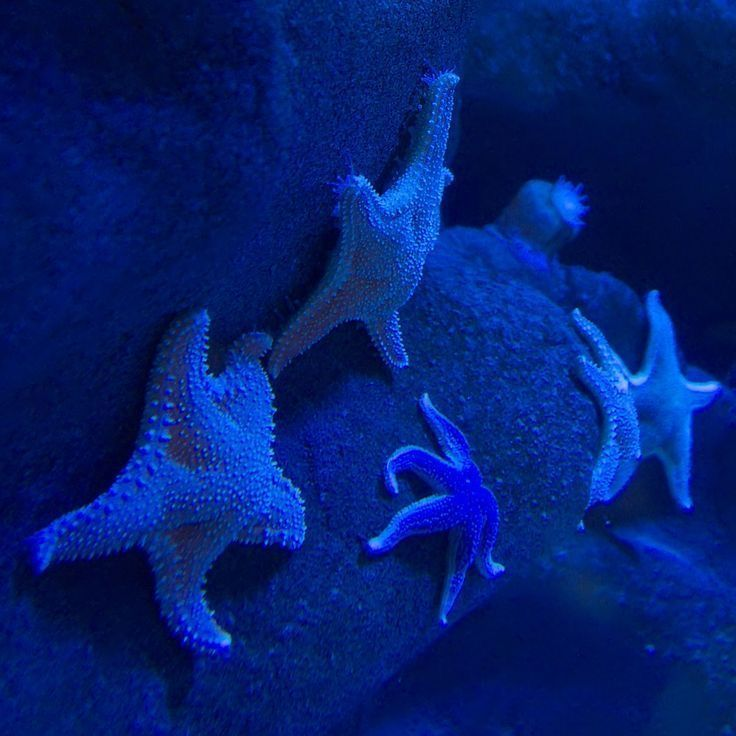

# 🌊 Day 2 - HTML Practice: Marine World 🌊

This project is part of my **HTML learning journey**.  
On **Day 2**, I created a simple webpage about marine creatures, practicing with:

- Basic HTML structure
- Adding a favicon
- Styling using inline CSS
- Using headings, paragraphs, and horizontal rules
- Inserting images
- Creating a form with radio buttons
- 

---

---

## 🖼️ Preview
The webpage introduces visitors to the **Marine World** and allows them to choose a creature they want to know about:

- 🪼 Jellyfish  
- 🐋 Whale  
- ⭐ Starfish  

Each option is displayed with an image and a radio button for selection.


---

## 💻 Code Used
```html
<!DOCTYPE html>
<html>
    <head>
        <title>Tides</title>
        <link rel="icon" href="jelly.jpeg">
    </head>
    <body style="color:white;background-color:rgb(9, 122, 171)">
        <h1>welcome to the marine world, where tides are restless and seas are boundless</h1>
        <hr>
        <p>choose the marine creature you want to know about</p>
        <form>
            <label for="jelly">Jellyfish</label>
            
            <input type="radio" id="jelly" name="creature" value="jellyfish">

            <label for="whale">whale</label>
            
            <input type="radio" id="whale" name="creature" value="whale">

            <label for="starfish">Starfish</label>
            
            <br>
            <input type="radio" id="starfish" name="creature" value="starfish">
        </form>
    </body>
</html>
